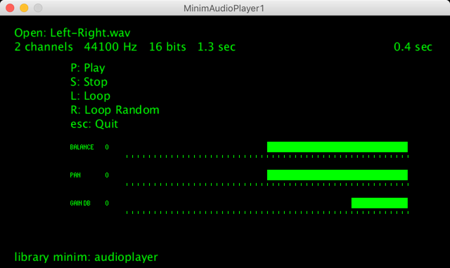

[Processing](https://processing.org/) sketch to test ["AudioPlayer"](http://code.compartmental.net/minim/audioplayer_class_audioplayer.html) of the [Minim](http://code.compartmental.net/minim/) library   
"An AudioPlayer provides a self-contained way of playing a sound file by streaming it from disk (or the internet)."  

OK Processing 1.5.1 + Windows 10  
OK Processing 3.5.4 + MacOS  
OK Processing 3.5.3 + Raspberry Pi OS (Raspbian 10 buster)  
OK Processing 3.5.3 + Windows  
with library minim  
with library controlP5  
