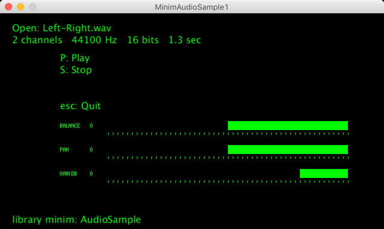

[Processing](https://processing.org/) sketch to test ["AudioSample"](http://code.compartmental.net/minim/audiosample_class_audiosample.html) of the [Minim](http://code.compartmental.net/minim/) library   
"An AudioSample keeps the entire file in an internal buffer and all you can do is trigger() the sound.  
We now recommend using Sampler class from the ugens package because it is more full-featured than AudioSample."  
  

OK Processing 3.5.4 + MacOS  
OK Processing 3.5.3 + Raspberry Pi OS (Raspbian 10 buster)  
OK Processing 3.5.3 + Windows  
with library minim  
with library controlP5  
