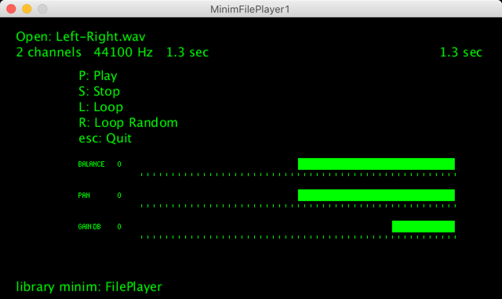

[Processing](https://processing.org/) sketch to test ["FilePlayer"](http://code.compartmental.net/minim/fileplayer_class_fileplayer.html) of the [Minim](http://code.compartmental.net/minim/) library   
"The FilePlayer UGen provides a way for you to play audio files in the same way that AudioPlayer does, allowing you to patch them into a UGen graph any way you choose."  

OK Processing 3.5.4 + MacOS  
OK Processing 3.5.3 + Raspberry Pi OS (Raspbian 10 buster)  
OK Processing 3.5.3 + Windows  
with library minim  
with library controlP5  
