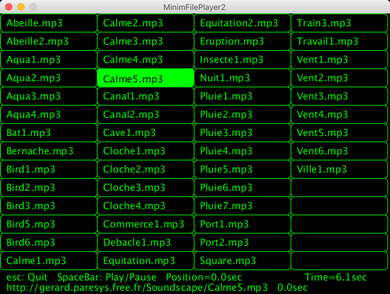

[Processing](https://processing.org/) sketch to test ["FilePlayer"](http://code.compartmental.net/minim/fileplayer_class_fileplayer.html) of the [Minim](http://code.compartmental.net/minim/) library   
"The FilePlayer UGen provides a way for you to play audio files in the same way that AudioPlayer does, allowing you to patch them into a UGen graph any way you choose."  
  
Play .mp3 audio files placed on the websites:  
https://paresys.pagesperso-orange.fr/Soundscape/  
http://gerard.paresys.free.fr/Soundscape/  
44100Hz 16bits Stereo 192kbps  
The same files are present on these 2 websites and on:  
https://soundcloud.com/gerard-paresys/sets/paresys-field-recording

Processing 3.5.4 + MacOS  
 - OK Site orange.fr  
 - OK Site free.fr  
 - OK with the files in a data folder  
  
Processing 3.5.3 + Raspberry Pi OS (Raspbian 10 buster)  
 - Pb Site orange.fr: Play stops after 23sec except files <120sec (Aqua1 Calme1 Calme2 Cloche1)  
 - Pb Site orange.fr & files in a data folder: Cannot restart playback of a 2nd file  
  
Processing 3.5.3 + Windows  
 - OK Site free.fr  
 - Pb Site orange.fr: Play stops after 20sec except files <120sec (Aqua1 Calme1 Calme2 Cloche1)  
  
Pb Site orange.fr & free.fr: MonFilePlayer.length()   is false;  
Pb Site orange.fr & free.fr: MonFilePlayer.position() is false;  
