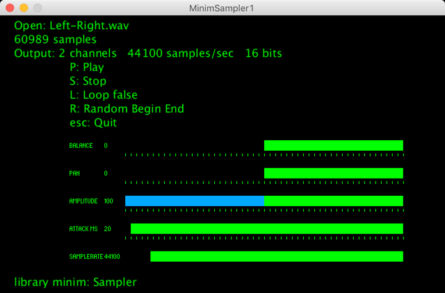

[Processing](https://processing.org/) sketch to test ["Sampler"](http://code.compartmental.net/minim/sampler_class_sampler.html) of the [Minim](http://code.compartmental.net/minim/) library   
"Sampler is the UGen version of AudioSample and is the preferred method of triggering short audio files."  

OK Processing 3.5.4 + MacOS  
OK Processing 3.5.3 + Raspberry Pi OS (Raspbian 10 buster)  
OK Processing 3.5.3 + Windows  
with library minim  
with library controlP5  

Problem: Know the duration of the Audio file (or the number of samples).  
To do: setSampleRate(float newSampleRate).  
