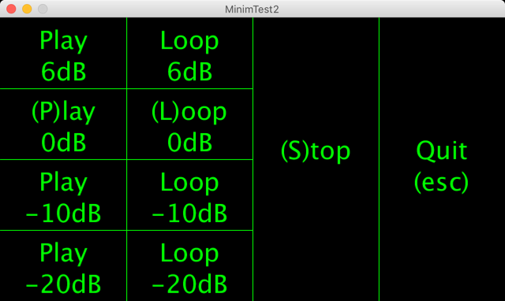

[Processing](https://processing.org/) sketch to test ["FilePlayer"](http://code.compartmental.net/minim/fileplayer_class_fileplayer.html) of the [Minim](http://code.compartmental.net/minim/) library   

OK Processing 3.5.4 + MacOS  
OK Processing 3.5.3 + Raspberry Pi OS (Raspbian 10 buster)  
OK Processing 3.5.3 + Ubuntu  
OK Processing 3.5.4 + Windows10  
Not compatible with Processing 2  
with library minim 
