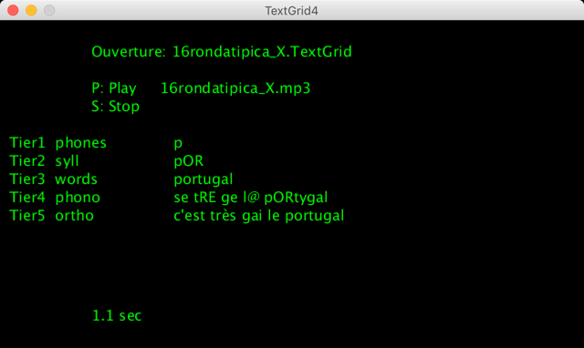
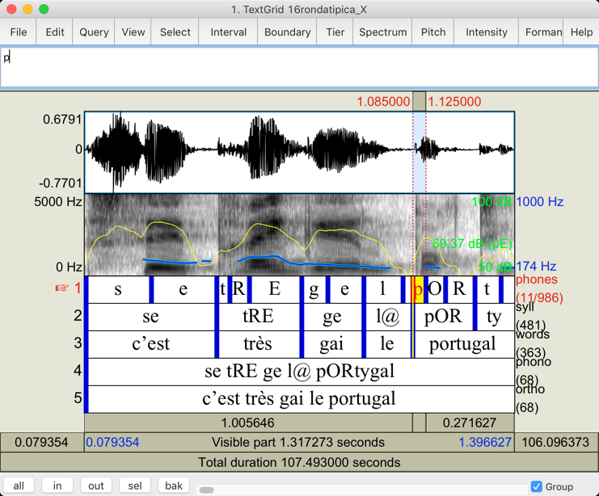

Processing sketch which opens a .TextGrid file and displays it in sync with Audio playback.  
The .TextGrid file must be UTF-8 encoded.  
The .TextGrid file was generated with ["Praat"](https://www.fon.hum.uva.nl/praat/).  
[TextGrid_file_formats](https://www.fon.hum.uva.nl/praat/manual/TextGrid_file_formats.html)   

OK Processing 2.2.1 MacOS  
OK Processing 3.5.4 MacOS  
OK Processing 3.5.3 Raspberry Pi OS (Raspbian 10 buster)  
OK Processing 3.5.3 Windows  
With [minim](http://code.compartmental.net/minim/) library.  

Audio files come from the projects ["Trous de mémoire"](https://guykayser.autoportrait.com/objetconversationnel/trous-de-memoire)  
and ["On ne se baigne jamais deux fois dans la même rivière"](https://guykayser.autoportrait.com/autoportrait-collec/on-ne-se-baigne-jamais-deux-fois-dans-la-meme-riviere)  
of Guykayser.  

Window Praat:  

